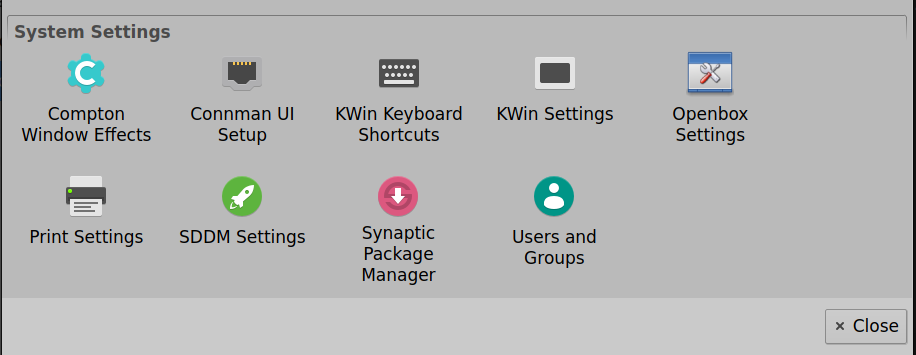
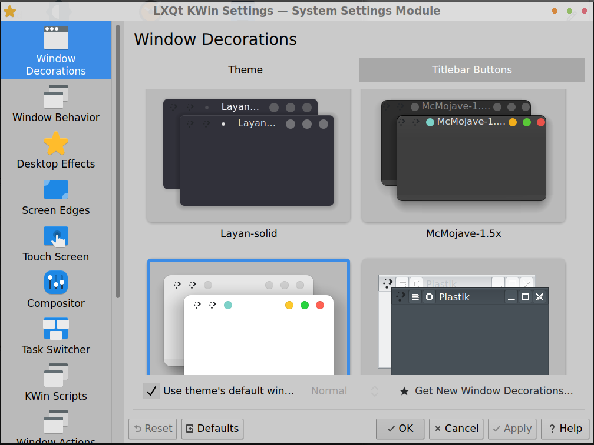

## KCM integration into LXQt

Provides `.desktop files` for KDE Plasma kcm modules.

#### All KWin Settings except keybindings
`lxqt-kcmshell5-kwinsettings.desktop`

Depends only on 'systemsettings' package.

#### Keyboard shortcuts settings for KWin

`lxqt-kcmshell5-keys.desktop`

#### Background and Autostart Settings for SDDM Display Manager
`lxqt-kcmshell5-sddm.desktop`

Depend both on 'plasma-desktop' package

#### Screenshots

